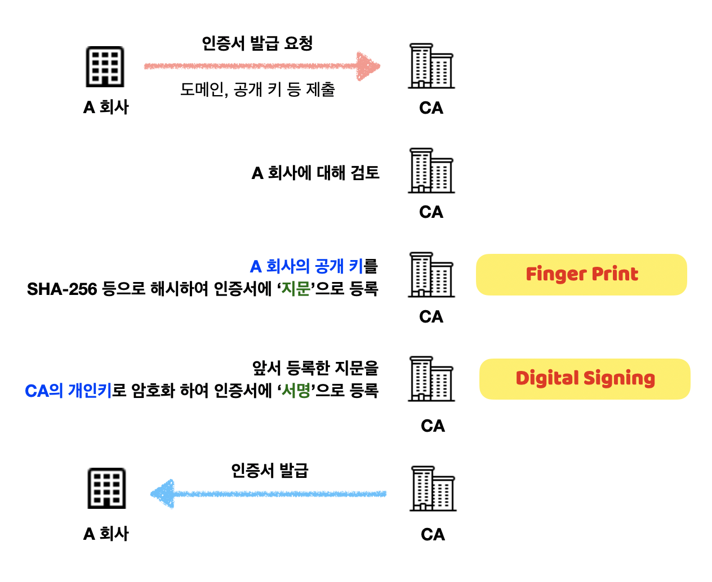
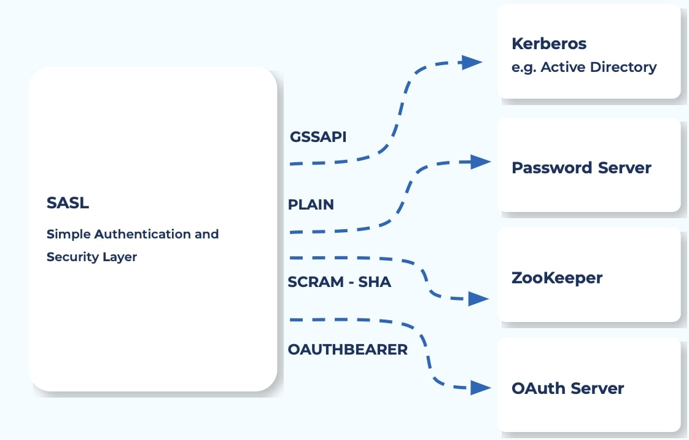
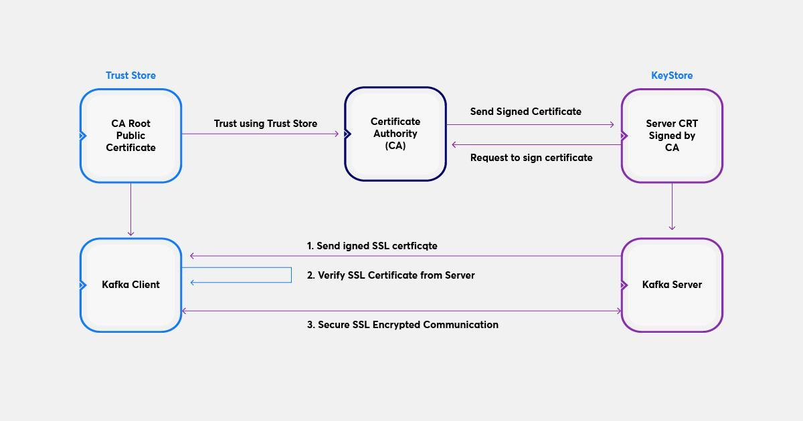
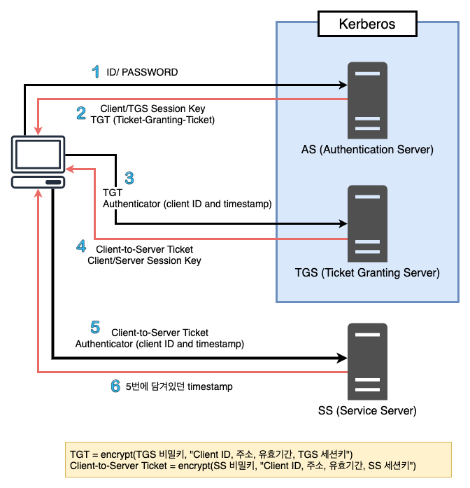

# 9.1 카프카 보안의 세 가지 요소
- 암호화  
악의적인 목적을 가진 사용자가 중간에서 패킷을 가로채더라도 암호화를 설정해두어 데이터를 읽을 수 없게 해야한다. 웹에 비유하면, 웹 페이지에 접근할 때 http가 아닌 https로 접근하는 것

- 인증  
카프카 클라이언트들이 카프카로 접근할 때 안전하다고 확인된 클라이언트만 접근할 수 있도록 설정하는 부분이다. 웹에 비유하자면, 아이디/비밀번호를 입력해 로그인에 성공한 사용자만 웹 페이지에 접근할 수 있는 것

- 권한  
권한을 설정한다는 것은 인증을 받은 A라는 클라이언트가 B라는 토픽으로만 메시지를 보내고 가져갈 수 있게 허락한다는 의미이다. 웹에 비유하면, 일반 사용자는 모두에게 공개된 웹 페이지에만 접근할 수 있고, 관리자는 비공개된 웹 페이지까지 접근할 수 있도록 설정하는 것

## 9.1.1 암호화(SSL)
보안 소켓 레이어(Secure Socket Layer, SSL) : 서버 - 서버 / 서버 - 클라이언트 사이에서 통신 보안을 적용하기 위한 표준 암호 규약
웹페이지에 https와 마찬가지로 카프카에서도 클라이언트와의 암호화 통신을 위해 SSL을 사용한다.

### SSL 동작방식
보안과 성능상의 이유로 두 가지 암호화 기법을 혼용해서 사용하고 있다.
- 대칭키  
암호화를 할 때 사용하는 일종의 비밀번호를 키. 이 키를 활용해 복호화를 진행한다.
- 비대칭키(공개키/비밀키)  
공개키 방식은 두 개의 키를 가지며, A키를 암호화하면 B키로 복호화할 수 있고, B키로 암호화하면 A키로 복호화할 수 있는 방식이다. 이런 방식을 활용해서 비공개키는 자신만 가지고, 공개키를 타인에게 제공한다. 공개키를 활용해 암호화된 정보는 비공개키로만 복호화 할 수 있다.

> TLS와 SSL의 차이점은 무엇일까?
TLS는 Netscape가 개발한 SSL(Secure Sockets Layer)이라고 불리는 이전의 암호화 프로토콜에서 발전한 것이다. TLS 버전 1.0은 SSL 버전 3.1로서 개발을 시작했지만 Netscape와 더 이상 연관이 없음을 명시하기 위해 발표 전에 프로토콜의 이름이 변경되었다. 이러한 역사 때문에 가끔 서로 바꿔서 사용된다.

## 9.1.2 인증(SASL)
SASL(Simple Authentication and Security Layer) : 인터넷 프로토콜에서 인증과 데이터 보안을 위한 프레임워크로서 카프카에서도 사용된다.

### SASL 매커니즘
- SASL/PLAINTEXT (0.9.0.0 ~)
  - PLAINTEXT로 username/password 를 설정하여 인증을 하는 가장 기본적이나 고전적인 방식
  - PLAINTEXT로 사용되는 username과 password는 kafka 브로커에 미리 저장되어 있어야 하며, 변경될 때마다 재시작이 필요
- SASL/SCRAM (0.10.0.0 ~)
  - PBKDF2 암호화 알고리즘을 활용해 생성된 해시를 활용하며 username/password 조합에 salt / count를 부가적으로 전달하여 보안을 높인 방법
  - username 과 password의 해시는 zookeeper에 저장되므로 브로커를 재부팅 불 필요
  - 네트워크에서 자격증명이 PAINTEXT로 전송되지 않도록 ssl 암호화를 활성화
- SASL/OAUITHBEARER (2.0 ~)
    - OAuth2 토큰을 기반으로 인증하는 방법으로 KIP(Kafka Improvement Proposals)를 통해 읽습니다.
- SASL/KERBEROS(GSSAPI) (0.9.0.0 ~)
    - 노드간 통신에서 보안을 client가 티켓을 발급받아 본인의 신원을 증명하면 인증하는 매우 안전한 방법
  - 별도의 인증 및 티켓검증용 서버가 필요하며 서버가 불능이 될 경우 인증 불가하므로 관리에 주의

## 9.1.3 권한(ACL)
### 모든 사용자에게 동일한 권한을 부여하는 경우
-> 손쉽게 자신이 원하는 데이터를 가져갈 수 있으므로 불필요한 커뮤니케이션 비용이 들지 않는다.
-> 프로듀서엣 실수 또는 커뮤니케이션 오류 등으로 다른 토픽에 전송하면 컨슈머가 토픽의 내용을 읽다가 파싱 에러가 발생하면서 예기치 않게 종료되거나 데이터 정합성 오류가 생기는 등 여러 문제가 발생할 수 있다.

### ACL(Access Control List, 접근 제어 리스트)
- 규칙 기반의 리스트를 만들어 접근 제어를 하는 것이다.
- CLI로 ACL을 추가하거나 삭제할 수 있으며 모든 ACL 규칙은 주키퍼에 저장된다.
- 토픽, 그룹, 클러스터, 트랜잭셔널 ID, 위임 토큰등의 리소스 타입별로 구체적인 설정이 가능하다.

> 그렇다면 카프카의 어떤 리소스까지 권한 관리가 가능할까?
토픽 (Topic)
컨슈머 그룹 (Group)
클러스터 (Cluster)
트랜젝션 ID (TransactionalId)
Delegation Token

> 다음 작업에 대한 권한 관리가 가능하다.
읽기 (Read)
쓰기 (Write)
생성 (Create)
삭제 (Delete)
수정 (Alter)
상세 (Describe)
ClusterAction
DescribeConfigs
AlterConfigs
IdempotentWrite
All

# 9.2 SSL을 이용한 카프카 암호화
키스토어(KeyStore)라 불리는 인터페이스를 통해 퍼블릭 키, 프라이빗 키, 인증서를 추상화해 제공한다.

## SSL 설정 과정
트러스트스토어 생성 -> 키스토어 생성 -> CSR 생성 및 서명 -> 키스토어에 인증서 추가 -> 브로커 Config 설정 (server.properties) -> SSL 통신 테스트

## 용어 설명
- 키스토어 : 일반적으로 서버 측면에서 프라이빗 키와 인증서를 저장, 자격 증명을 제공한다.
- 트러스트스토어 : 클라이언트 측면에서 서버가 제공하는 인증서를 검증하기 위한 퍼블릭 키와 서버와 SSL 연결에서 유효성을 검사하는 서명된 인증서를 저장

# 9.3 커버로스(SASL)를 이용한 카프카 인증
## 커버로스
- Kerberos는 티켓을 기반으로 동작하는 암호화 프로토콜로서 클라이언트/ 서버 사이의 인증을 제공하도록 설계되었다.
- 대칭키 암호기법을 사용하며 윈도우 서버 운영체제의 기본 인증방법으로 활용되고 있다. (LDAP)

Kerberos 서버군에는 AS(Authentication Server), TGS(Ticket Granting Server)가 있다. 각 서버의 역할을 간략화 하면 다음과 같다.

- AS : 실질적 인증 수행
- TGS : 티켓 부여

그리고 추가로 기억해야 할 요소로 SS(Service Server), Ticket, Principals이 있다.

- SS : 서비스가 구현된 Server. 인증 처리가 필요한 서비스
- Ticket : 사용자에 대한 인증 확인을 위한 토큰. 다른 SS와 통신 시 패스워드 재입력을 필요하지 않게 함.
- Principals : 인증을 위해 Kerberos 프로토콜을 사용하는 모든 개체

### 커버로스 동작 방식

